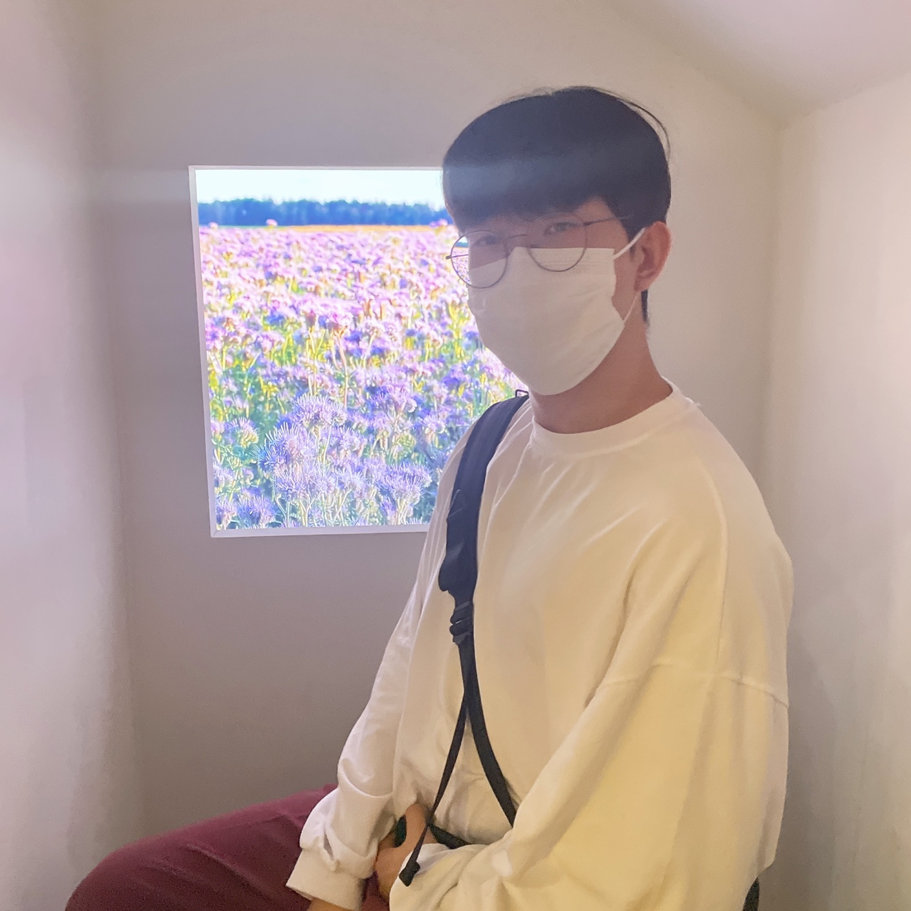

# 🚧 WIP 🚧 offbeat-frontend

### 해외에서 찾는 k-place

## 💻 Develop by

<table>
  <tr>
    <td align="center"><a href="https://github.com/saseungmin"> 
<b>Harang</b>
</a><small>⚛️ Front-End Developer</small></td>
    <td align="center"><a href="https://github.com/jooseyoung"> 
<b>Jenny</b>
</a><small>🎨 Product Designer</small></td>
    <td align="center"><a href="https://github.com/ejolie"> 
<b>Marron</b>
</a><small>👩🏻‍💻 Back-End Developer</small></td>
  </tr>
</table>

## 🐛 Bug reporting
[Issues](https://github.com/mbti-nf-team/offbeat-frontend/issues?q=is%3Aissue+is%3Aopen+sort%3Aupdated-desc)

## 🔒 LICENSE
This Project is [MIT licensed](https://github.com/mbti-nf-team/offbeat-frontend/blob/main/LICENSE).
